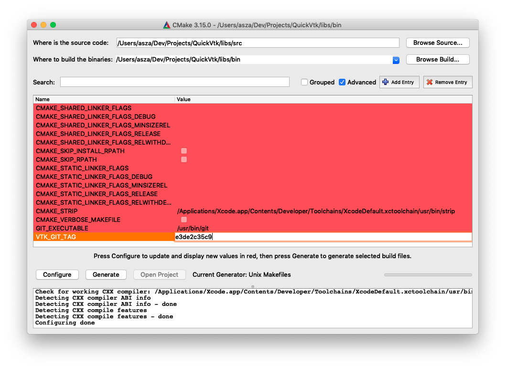
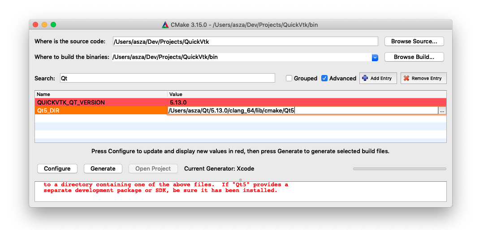
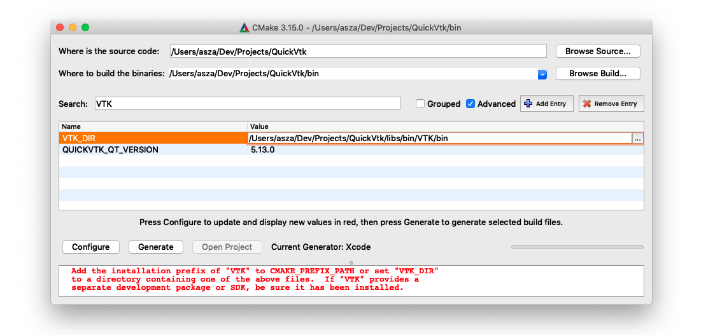
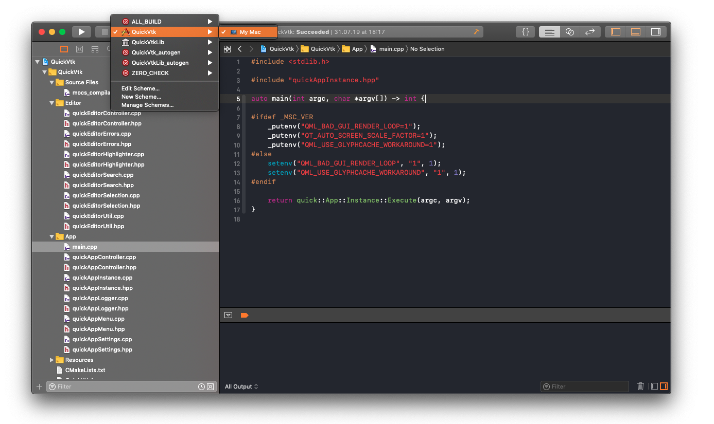

QuickVtk
===
Build Instructions - macOS
----

### 1. Download and install [CMake](https://cmake.org)

### 2. Download and install [Qt](https://www.qt.io/download/)

### 3. Build VTK
	
- Launch [**CMake**](https://cmake.org) and set the paths to build [**VTK**](http://www.vtk.org) from the `libs` folder:

	- **src**: `QuickVtk/libs/src`
	- **bin**: `QuickVtk/libs/bin`

- Press **Configure** and specify a project generator. It is recommended to use Unix Makefiles for faster builds

	

- Use the **VTK\_GIT\_TAG** attribute to specify a commit hash which will be used to download and build a specific [**VTK**](http://www.vtk.org)-version from the remote repository 

- Press **Configure** and then **Generate**

- Open the terminal and navigate to `/libs/bin` in the project directory. From there, use the **make** command to invoke the build process. [**VTK**](http://www.vtk.org) will first be cloned so make sure you are connected to the internet

	

### 4. Build QuickVtk 

- Launch [**CMake**](https://cmake.org) and set the paths accordingly:

	- **src**: `QuickVtk`
	- **bin**: `QuickVtk/bin`

- Press **Configure** and select a project generator

- In most cases, [**CMake**](https://cmake.org) will fail to find [**Qt**](https://www.qt.io/). Confirm the error dialog and enter `Qt` in the search field. Set the path to `Qt5Config.cmake` which might vary depending on your [**Qt**](https://www.qt.io/)-installation. 

	

- Press **Configure** again

- Another error will probably pop up. This time [**VTK**](http://www.vtk.org) was not found. Type `VTK` in the search field and set the path to `libs/bin/VTK/bin` from the project root directory

	

- Press **Configure** and then **Generate**

### 4.1 Building via XCode

- Open the generated `.xcodeproj` file from the `bin` folder

- Change the build target from `ALL_BUILD` to `QuickVtk`

	

- Hit <kbd>⌘</kbd> + `R` to build and run QuickVtk
