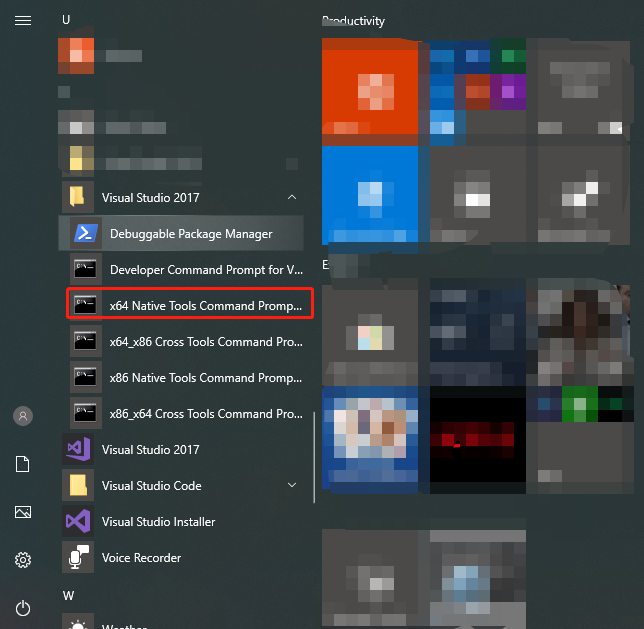
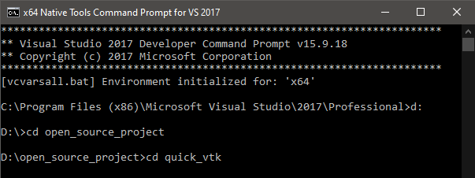
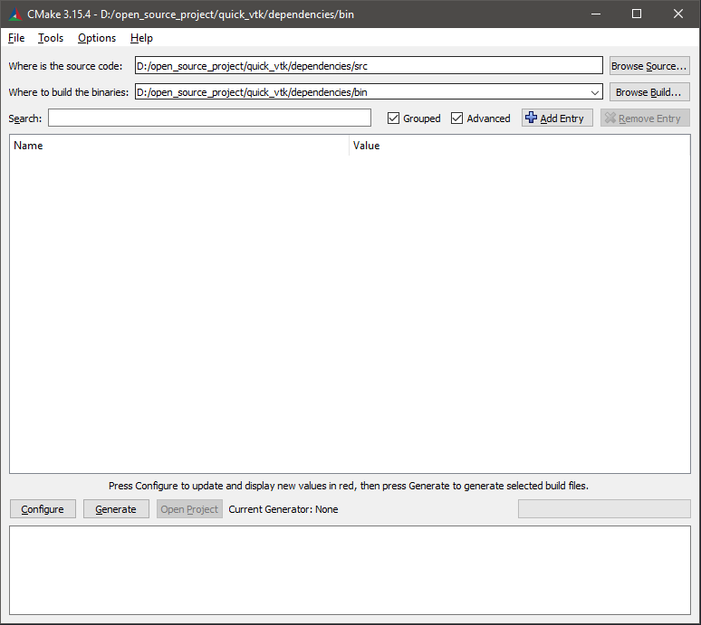
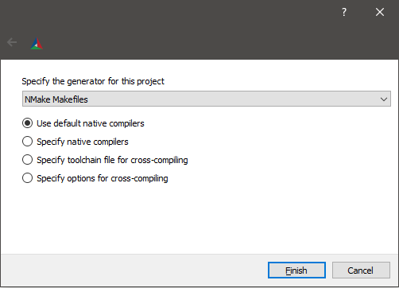
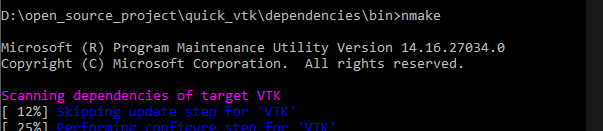
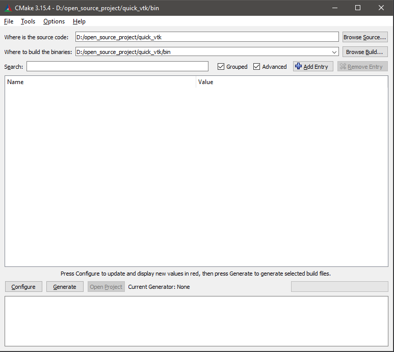
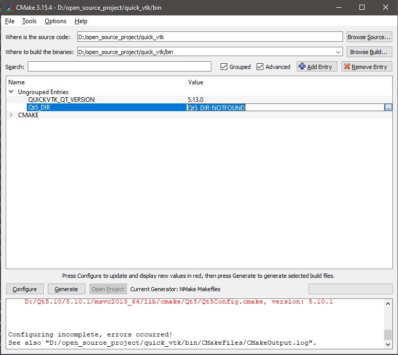
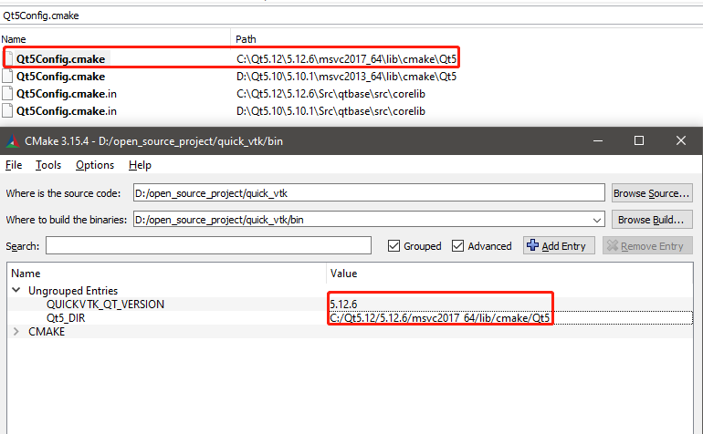
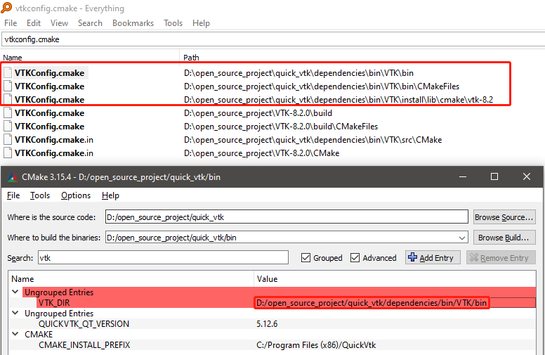
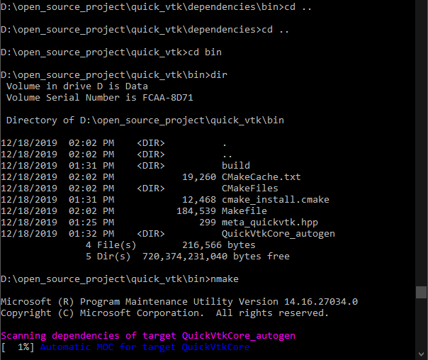

# QuickVtk

Build Instructions for windows

## 1. Download and install [CMake](https://cmake.org)

Add cmake executables path(C:\Program Files\CMake\bin) to **PATH** environment variable is recommended.

## 2. Download and install [Qt](https://www.qt.io/download/)

## 3. Download and instatll [Visual Studio](https://visualstudio.microsoft.com/)

## 4. Build [VTK](https://vtk.org/)

- Open a developer command prompt(I will call this terminal from now on)

<center>
	
</center>

<center>
	
</center>

- Open **cmake-gui**

    Type cmake-gui in your terminal, a cmake graphical user interface will open.Make sure open cmake-gui from this termimal to get the necessary build tools.

    ```batch
    cmake-gui
    ```

    **Warning:** If you didn't add the path of cmake-gui to PATH, you should type the full path of cmake-gui.exe

- Set the source and binary path in cmake-gui.

<center>

</center>

- Press **Configure** and select a project generator.**Visual Studio** and **NMake Makefiles** both are OK.I use NMake Makefiles here.

<center>

</center>

- You may want to use the **VTK\_GIT\_TAG** attribute to specify a commit hash of the [latest release](https://github.com/Kitware/VTK/releases) version which will be used to download and build a specific **VTK**-version from the remote repository, the default is the latest versin for now: 8.2.0.

<center>

</center>

- Press **Configure** and then **Generate**

- Open the terminal and navigate to `/dependencies/bin` in the project directory. From there, use the **nmake** command to invoke the build process. [**VTK**](http://www.vtk.org) will first be cloned so make sure you are connected to the internet
- Wait the build precess to complete, it may take a long time.

    ```batch
    cd dependencies/bin
    nmake
    ```

<center>
    
</center>

**Warning:** Use **msbuild** or **Visual Studio** to build if you selected the **Visual Studio** as the generator.

### 4. Build QuickVtk

- Launch **cmake-gui** and set the paths accordingly:

<center>
    
</center>

- Press **Configure** and select a project generator

- In most cases, **CMake** will fail to find **Qt**. Confirm the error dialog and enter `Qt` in the search field. Set the path to `Qt5Config.cmake` which might vary depending on your **Qt**-installation.

<center>
	
</center>

<center>
	
</center>

- Press **Configure** again

- Another error will probably pop up. This time [**VTK**](http://www.vtk.org) was not found. Type `VTK` in the search field and set the path to `dependencies/bin/VTK/bin` from the project root directory

<center>
	
</center>

- Press **Configure** and then **Generate**

### 4.1 Build

Build QuickVtk in the terminal
```batch
cd bin
nmake
```

<center>
	
</center>

1. enable **Module_vtkRenderingExternal** when build vtk.
2. Set **VTK_DIR** to the build/install path of vtk when build QuickVtk
