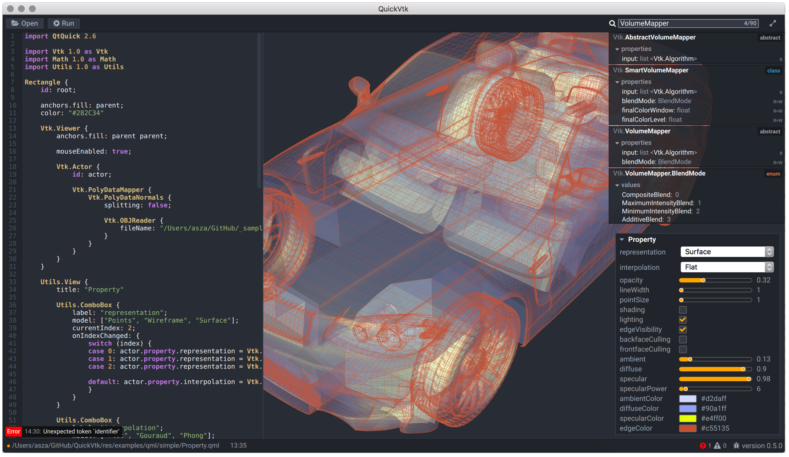
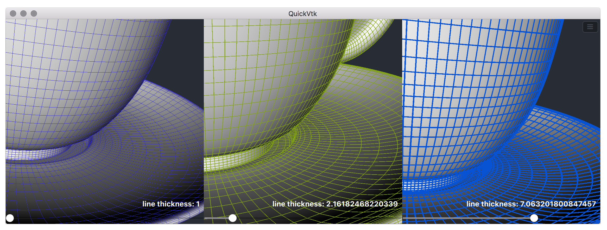
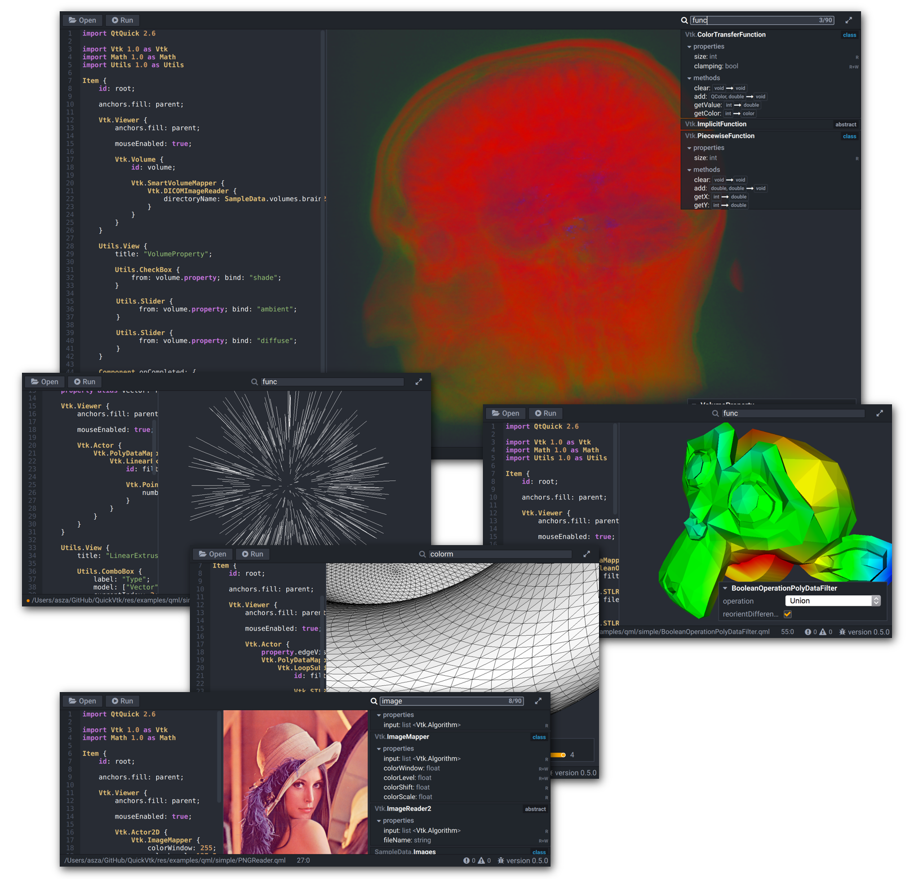
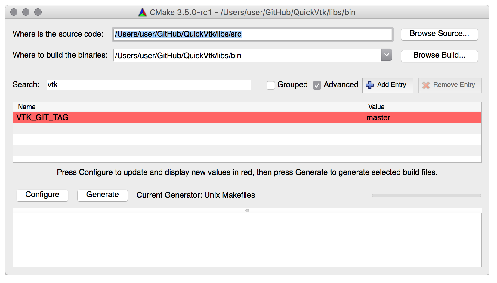
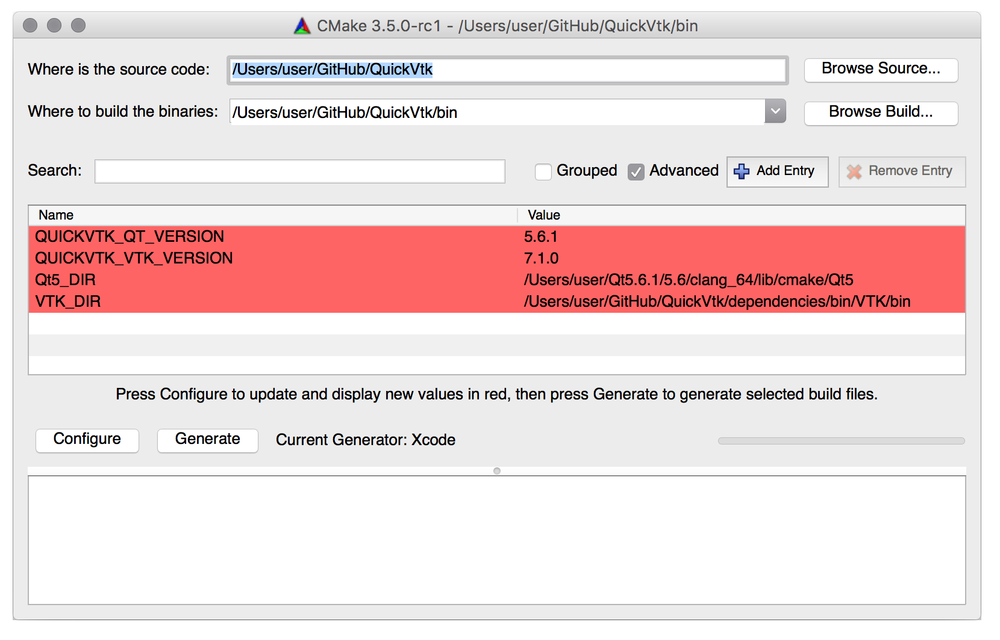
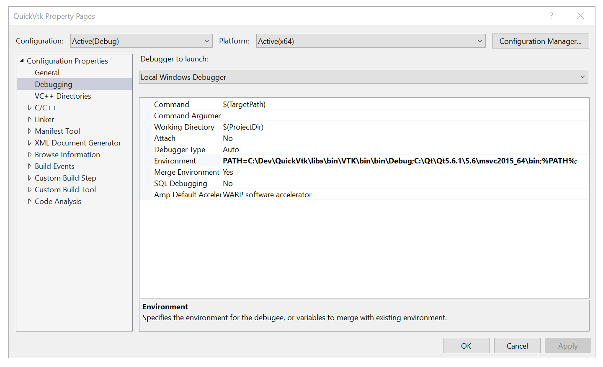

QuickVtk
===

A live **[QML](http://doc.qt.io/qt-5/qtqml-index.html)** interpreter with embedded **[VTK](http://www.vtk.org)** support

	

Overview
----

###Rapid QML Prototyping
QuickVtk allows quick prototyping of **[QML](http://doc.qt.io/qt-5/qtqml-index.html)** code. Load a *.qml* file, edit the code in an external editor and save the file (an embedded editor will be available somewhere in the future). QuickVtk then automatically reloads and compiles the modified file, informs you about eventual errors during compilation and finally shows the generated content. A simple way to learn, test or prototype **[QML](http://doc.qt.io/qt-5/qtqml-index.html)** code on the fly.

###VTK in QML
Bringing **[VTK](http://www.vtk.org)** to **[QML](http://doc.qt.io/qt-5/qtqml-index.html)** is the real purpose of this project. Having **[VTK](http://www.vtk.org)** objects and their attributes available in **[QML](http://doc.qt.io/qt-5/qtqml-index.html)** just as built-in types in combination with high-level functionality provided by the **[QML](http://doc.qt.io/qt-5/qtqml-index.html)** engine makes it possible to develop interactive prototypes in the domain of 2D/3D visualization.
 
	import QtQuick 2.6
	
	import Vtk 1.0 as Vtk
		
	Vtk.Viewer { 
		anchors.fill: parent;
					
		Vtk.Actor {
			Vtk.PolyDataMapper {
				Vtk.ShrinkPolyData {
					Vtk.OBJReader {
						fileName: "car.obj"
					}
				}
			}
		}
	}

###Reactive Programming For VTK
This is probably the coolest thing about bringing **[VTK](http://www.vtk.org)** to **[QML](http://doc.qt.io/qt-5/qtqml-index.html)**. You can bind **[VTK](http://www.vtk.org)** class attributes to pretty much anything using **[Property Bindings](http://doc.qt.io/qt-5/qtqml-syntax-propertybinding.html)** which allow you to control variables directly or indirectly by:

- other properties
- user interaction with UI elements
- inline or included **[JavaScript](http://doc.qt.io/qt-5/qtqml-javascript-expressions.html)** code
- **[QML Animations](http://doc.qt.io/qt-5/qml-qtquick-animation.html)**
- **[QML Behaviors](http://doc.qt.io/qt-5/qml-qtquick-behavior.html)**

	

The above screenshots shows how an interactive slider component controls the 'lineThickness' property of an underlying vtkProperty object. All changes are applied and rendered immediately.

###Type Information
Available types in QuickVtk are outlined in the application's type browser and provide a detailed overview of important information:

- Type information
	- type name
	- category [abstract, class, enum]
- Properties
	- property name
	- property type
	- property access [read-only, read-write]
- Functions
	- function name
	- argument types
	- return type

Information of QuickVtk's classes is generated automatically by utilizing the associated static **[QMetaObject](http://doc.qt.io/qt-5/qmetaobject.html)** of a given type, reflecting the API as is.

###Performance
QuickVtk is written in C++. **[VTK](http://www.vtk.org)**'s rendering backend uses OpenGL and is rendered in **[QML](http://doc.qt.io/qt-5/qtqml-index.html)** using a framebuffer object (FBO). This allows integration of **[VTK](http://www.vtk.org)** content in the **[QML](http://doc.qt.io/qt-5/qtqml-index.html)** scene graph for efficient rendering. The following screenshot shows multiple **[VTK](http://www.vtk.org)** viewer instances arranged in a **[Grid](http://doc.qt.io/qt-5/qml-qtquick-grid.html)** component:

	

Building QuickVtk
----
QuickVtk can be built for Mac OS X and Windows via **[CMake](https://cmake.org)**. Building the project takes three steps:

### Step 1 - Install the Qt binaries

Download and launch the installer from the **[Qt download section](https://www.qt.io/download/)**.

### Step 2 - Build VTK

**[VTK](http://www.vtk.org)** can be built as a separate project from the **libs** folder located in the project directory. Launch **[CMake](https://cmake.org)** and set the paths to src and bin:

- **src**: QuickVtk/libs/src
- **bin**: QuickVtk/libs/bin

	

You can specify a git tag to build a certain version of **[VTK](http://www.vtk.org)**. Configure, generate and build the project.

Alternatively, you can build **[VTK](http://www.vtk.org)** manually or use already built binaries from your system if available. Just make sure to use  **OpenGL** for the **VTK\_RENDERING\_BACKEND** option since QuickVtk's offscreen rendering setup does not yet support OpenGL2 which is the default rendering backend for **[VTK](http://www.vtk.org)** since version 7.

###Step 3 - Build QuickVtk
After successfully installing **[Qt](http://www.qt.io)** and building **[VTK](http://www.vtk.org)**, launch **[CMake](https://cmake.org)** and set the paths to src and bin:

- **src**: QuickVtk
- **bin**: QuickVtk/bin

	

Specify the version and path attributes for **[Qt](http://www.qt.io)** and **[VTK](http://www.vtk.org)** and finally configure, generate and build the project. Tested project generators are:

- Unix Makefile (recommended for building VTK on Mac OS X)
- XCode (recommended for building QuickVtk on Mac OS X)
- Microsoft Visual Studio 2015 (for Windows)

**Note when building with Visual Studio:**
Make sure to set the environment in the IDE. Add the paths for **[Qt](http://www.qt.io)** and **[VTK](http://www.vtk.org)** to the *Environment* field found in the project properties view under *Debugging*:

	

Sample Data
----
A list of all sample data files which are located in **res/examples/data/**

- `suzanne`: low-poly mesh *(exported to .obj and .stl)* from [Blender](https://www.blender.org)
- `lena`: testing image *(exported to .png, .jpg and .tiff)* from [Wikipedia](https://en.wikipedia.org/wiki/File:Lenna.png)
- `brain`: DICOM data from [idoimaging.com](http://idoimaging.com) (special thanks to Andrew Crabb)

Contact
----

If you're interested in the project, want to give some feedback or just have some questions or suggestions

feel free to write a <a href="mailto:qCring@gmail.com">mail</a> :)

License
----

Copyright (c) 2016, Alexander Eduard Szalo
All rights reserved.

Redistribution and use in source and binary forms, with or without modification, are permitted provided that the following conditions are met:

1. Redistributions of source code must retain the above copyright notice, this list of conditions and the following disclaimer.

2. Redistributions in binary form must reproduce the above copyright notice, this list of conditions and the following disclaimer in the documentation and/or other materials provided with the distribution.

3. Neither the name of the copyright holder nor the names of its contributors may be used to endorse or promote products derived from this software without specific prior written permission.

THIS SOFTWARE IS PROVIDED BY THE COPYRIGHT HOLDERS AND CONTRIBUTORS "AS IS" AND ANY EXPRESS OR IMPLIED WARRANTIES, INCLUDING, BUT NOT LIMITED TO, THE IMPLIED WARRANTIES OF MERCHANTABILITY AND FITNESS FOR A PARTICULAR PURPOSE ARE DISCLAIMED. IN NO EVENT SHALL THE COPYRIGHT HOLDER OR CONTRIBUTORS BE LIABLE FOR ANY DIRECT, INDIRECT, INCIDENTAL, SPECIAL, EXEMPLARY, OR CONSEQUENTIAL DAMAGES (INCLUDING, BUT NOT LIMITED TO, PROCUREMENT OF SUBSTITUTE GOODS OR SERVICES; LOSS OF USE, DATA, OR PROFITS; OR BUSINESS INTERRUPTION) HOWEVER CAUSED AND ON ANY THEORY OF LIABILITY, WHETHER IN CONTRACT, STRICT LIABILITY, OR TORT (INCLUDING NEGLIGENCE OR OTHERWISE) ARISING IN ANY WAY OUT OF THE USE OF THIS SOFTWARE, EVEN IF ADVISED OF THE POSSIBILITY OF SUCH DAMAGE.