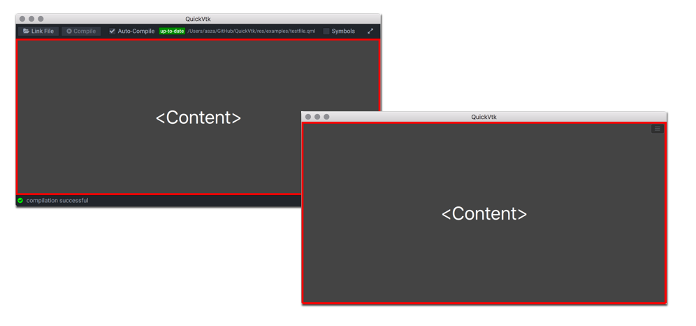
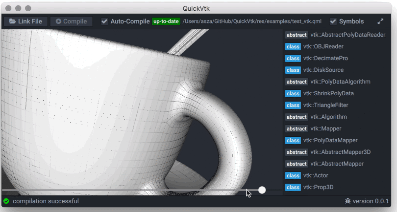

QuickVtk
===
A live **[QML](http://doc.qt.io/qt-5/qtqml-index.html)** interpreter with embedded **[VTK](http://www.vtk.org)** support

	

##Overview
###QML Prototyping
Even if you're not particularly interested in **[VTK](http://www.vtk.org)**, QuickVtk can be used to quickly write some **[QML](http://doc.qt.io/qt-5/qtqml-index.html)** code. Load a *.qml* file in the application, edit the code in an external editor of your choice and save the file. QuickVtk automatically recompiles and updates the content view if the currently loaded file has been modified.

Dynamically created **[QML](http://doc.qt.io/qt-5/qtqml-index.html)** content will be embedded in a container item to prevent items from overlapping control elements of the application. An "expanded view mode" allows to exclusively view the created content.

	

###Use VTK With QML
Since **[VTK](http://www.vtk.org)**  classes are available in **[QML](http://doc.qt.io/qt-5/qtqml-index.html)** just like built-in types, it's possible to interact with associated member variables using **[property bindings](http://doc.qt.io/qt-5/qtqml-syntax-propertybinding.html)**. Basically, this allows any parameter to be controlled by any other static or dynamic property.
Here for example the **vtkShrinkPolyData**`s **shrinkFactor** parameter is controlled by user interaction with a **[QtQuick.Controls](http://doc.qt.io/qt-5/qtquickcontrols-index.html)** Slider component:

	

###Really Simple
All the information about types, attributes and their relationship becomes clear at first sight. Plus there's really not much of any setup overhead which keeps the code size at a minimum. The full code for the above example looks like this:

	import QtQuick 2.5
	import QtQuick.Controls 1.4
	import Vtk 1.0

	Item {
		anchors.fill: parent;
		
		Viewer { 
			anchors.fill: parent;
			mouseEnabled: true;
			
			Actor {
				PolyDataMapper {
					ShrinkPolyData {
						shrinkFactor: slider.value;
						
						OBJReader {
							fileName: "coffee.obj"
						}
					}
				}
			}
		}
		
		Slider {
			id: slider;
			
			anchors.left: parent.left;
			anchors.right: parent.right;
			anchors.bottom: parent.bottom;
			
			miminumValue: 0.01;
			maximumValue: 1;
			value: 0.5;
		}
	}	

Building QuickVtk
----
QuickVtk can be built for Mac OS X and Windows via **[CMake](https://cmake.org)**

1. Download and install **[Qt](https://www.qt.io/download/)**
2. Get the **[VTK sources](https://github.com/Kitware/VTK)**
3. Build VTK via CMake
4. Build QuickVtk via CMake

**Important Notes:**

- When building VTK, make sure to use  **OpenGL** as **VTK\_RENDERING\_BACKEND** since things seem to have changed with **OpenGL2**
- On Windows, the renderWindowInteractor has an issue with the offscreen rendering setup and therefore is currently disabled. Which is sad but at least prevents the app from crashing.

Contact
----

Write me an <a href="mailto:a.e.szalo@gmail.com">e-mail</a>!

License
----

Copyright (c) 2016, Alexander Eduard Szalo
All rights reserved.

Redistribution and use in source and binary forms, with or without modification, are permitted provided that the following conditions are met:

1. Redistributions of source code must retain the above copyright notice, this list of conditions and the following disclaimer.

2. Redistributions in binary form must reproduce the above copyright notice, this list of conditions and the following disclaimer in the documentation and/or other materials provided with the distribution.

3. Neither the name of the copyright holder nor the names of its contributors may be used to endorse or promote products derived from this software without specific prior written permission.

THIS SOFTWARE IS PROVIDED BY THE COPYRIGHT HOLDERS AND CONTRIBUTORS "AS IS" AND ANY EXPRESS OR IMPLIED WARRANTIES, INCLUDING, BUT NOT LIMITED TO, THE IMPLIED WARRANTIES OF MERCHANTABILITY AND FITNESS FOR A PARTICULAR PURPOSE ARE DISCLAIMED. IN NO EVENT SHALL THE COPYRIGHT HOLDER OR CONTRIBUTORS BE LIABLE FOR ANY DIRECT, INDIRECT, INCIDENTAL, SPECIAL, EXEMPLARY, OR CONSEQUENTIAL DAMAGES (INCLUDING, BUT NOT LIMITED TO, PROCUREMENT OF SUBSTITUTE GOODS OR SERVICES; LOSS OF USE, DATA, OR PROFITS; OR BUSINESS INTERRUPTION) HOWEVER CAUSED AND ON ANY THEORY OF LIABILITY, WHETHER IN CONTRACT, STRICT LIABILITY, OR TORT (INCLUDING NEGLIGENCE OR OTHERWISE) ARISING IN ANY WAY OUT OF THE USE OF THIS SOFTWARE, EVEN IF ADVISED OF THE POSSIBILITY OF SUCH DAMAGE.